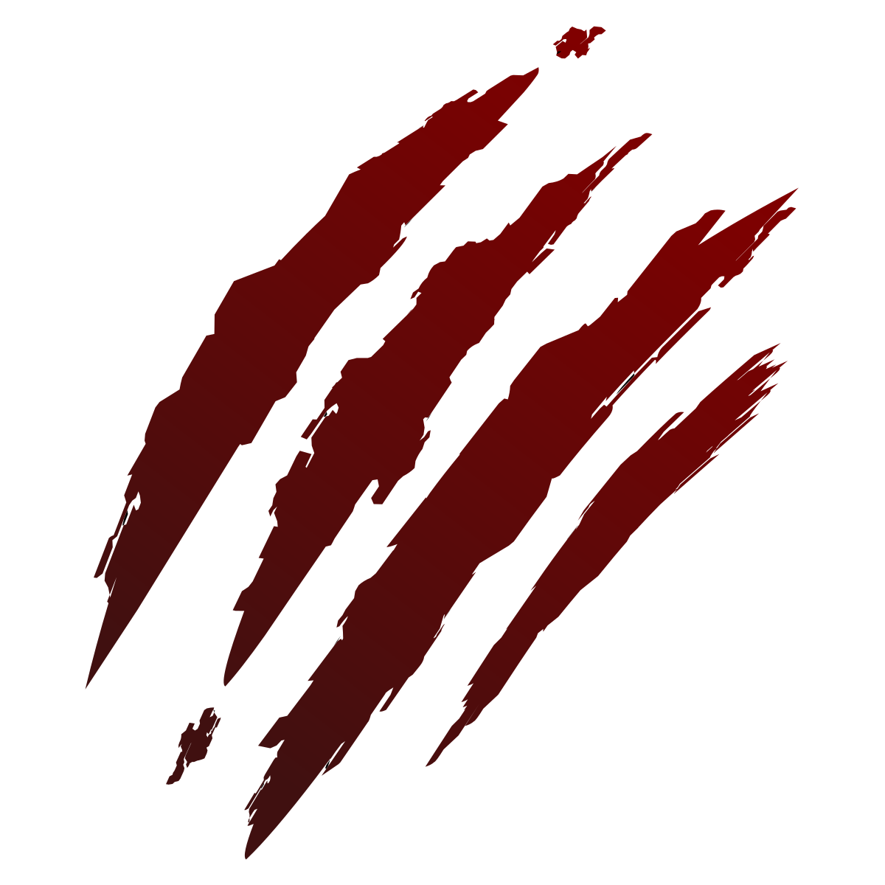

# Rouge

[](https://github.com/AshtonSnapp/rouge/actions/workflows/rust.yml)

Rouge (pronounced 'rooj', like the Louisiana state capital of Baton Rouge) is a statically-typed programming language designed for two primary uses: applications (graphical and command-line), and embedding into native programs (plugins, config files). To be suitable for both use cases, Rouge aims to have the following feature set:

 - A memory management model that aims to be intuitive and fast but with at least some guarantees towards memory and thread safety.
	- Currently considering mutable value semantics (already have `mut` keyword as a suitable substitute for `inout`, maybe add a `take` keyword as equivalent to `sink` from Val? no need for a `set` keyword though)
	- Since user-defined types will be generally heap-allocated, looking into ways to manage said heap. And, yes, even though I'm looking at mutable value semantics, non-primitive types will be reference passed. I mean hey, Swift's `class`es are by-reference!
 - A (mostly) simple syntax. Originally it was based on a combination of Ruby, Python, and Rust, but it evolved over time.
	- At this point it's been described by u/Uploft on Reddit as a combination of Julia, Scala, and Swift. All interesting languages. Haven't touched Swift though - I don't own a Mac (yes I know it runs on Linux too, just not as well from what I've heard).
 - Interpreted for development and use in config files, bytecode-compiled for distribution.
 - Extreme flexibility provided to the programmer.
	- There's always a balance to be made with this stuff, obviously, but I'd rather not force everyone to code in a particular way. You have your preferences for how you like to code - Rouge should be able to adapt to you best it can instead of forcing you to adapt to it. Hopefully there'll be enough options to allow this flexibility, but not so many that every codebase is vastly different and unreadable.

The custom runtime environment (RTE) for the Rouge programming language will be provided as a Rust library (and someone can probably work on making a wrapping cdylib for interfacing with other languages) for embedding, and as a standalone utility for applications. Both will simply be called `rouge` and contain everything necessary to run and compile Rouge code.

Rouge is currently licensed under MIT.

For the project's Code of Conflict, please click [here](./CONFLICT.md).

(Current probably-temporary logo derived from ["claw scratch" by Feri Saputra, from Noun Project](https://thenounproject.com/icon/claw-scratch-4766678/). Literally all I did was download it and change the color to a red gradient. I don't have to attribute, since I paid for it thinking it was necessary to be allowed to edit, but not doing so would be a jerk move in my opinion so here we are.)

## Current TODO List

### High Priority

 - [ ] Create a functioning RTE and compiler.
	- [ ] Design the RTE's instruction set and the bytecode file format.
	- [ ] Design an intuitive interface for communication between a native program and an embedded Rouge runtime.
	- [ ] Design a read-eval-print-loop (REPL), or interactive session, for the RTE.
 - [ ] Create the standard library.
 - [ ] Create documentation.
	- [ ] (Optional) Specifications (at least semi-formal) for the language and related things.
 - [ ] Create a functioning command-line utility.

### Medium Priority

 - [ ] Create a toolchain (e.g. dependency/project manager, doctool, language server)

### Low Priority

 - [ ] Branding.

## A Quick Tour of What's to Come

Rouge isn't really implemented yet, and a lot of things are probably going to change (especially if people other than me start contributing to the project), but I'll try and give some examples that give a general feel of what the language should be like.

### "Hello, world!" but in French

```rouge
pub func main() do
	outl!("Bonjour le monde!")
end
```

(I wanted to go with Louisiana Creole since it's an endangered language, but because it is an endangered language I haven't been able to find much in the way of resources I could use to put together a translation.)

### Variables and Primitive Data Types

```rouge
pub func main() do
	# An `int` can contain a positive or negative whole number.
	year: int = 2022
	
	# A `nat` can only contain a positive whole number.
	day: nat = 252
	
	# A `float` can contain a whole or non-whole number.
	hour: float = 11.916

	# A `byte` is similar to a `nat`, except it is limited to values in the range of 0 to 255. It is meant for representing binary data - bytes.
	meaning_of_life: byte = b'*'

	# A `bool` holds a true or false value.
	is_finished: bool = false

	# A `char` holds any single Unicode scalar value. This may not exactly match your view of what a character is at any given time - some things that appear as a single character are actually multiple. It's weird.
	english_favorite_vowel: char = 'ə'

	# A `tuple` holds some set of related information.
	position: (float, float) = (1.0, 2.0)

	# Tuple members are accessed using dot syntax with a number starting from 0.
	outl!("{}, {}", position.0, position.1)

	# The elements of a tuple don't have to be of the same type.
	byte_and_char: (byte, char) = (42, '*')

	# A `list` contains some unspecified number of some type of item.
	fibonacci: [nat] = [1, 1, 2, 3, 5, 8, 13, 21, 34]

	# List elements are accessed using bracket syntax with a number representing the index into the list. The index starts from 0.
	outl!("Element {} of the fibonacci sequence is {}.", 7, fibonacci[6])

	# A `string` is just a list of characters.
	capital: string = "Baton Rouge"

	# A list of bytes can be represented with a byte string.
	linux_binary_magic: [byte] = b"ELF"

	# A `map` allows you to use one type to get another type. The first type is called the key, the second type is the value.
	classes: [string: float] = ["English 101": 3.0, "Calculus 101": 2.5, "Computer Science 101": 4.0]

	# Map entries are accessed using bracket syntax with the key you want to get the value of.
	outl!("Your GPA in Computer Science 101 is {}", classes["Computer Science 101"])

	# The `mut` keyword goes before a variable's type to specify that changing (or mutating) the variable's value in your code is allowed.
	# Type inferrence is handled by simply omitting the type, and often includes 
	mut my_age := 22
	my_age += 1 # this is allowed
	day += 2 # this is not allowed, day is not declared as mutable
end
```

### Control Flow

```rouge
pub func main() do
	name := prompt!("What's your name? ")

	# Simple control flow using `if`, `elif` (else if), and `else`.
	if name == "Rouge" then
		outl!("Hey, that's MY name!")
	elif name == "Ashton" then
		outl!("Isn't that the name of the guy who created me?")
	else outl!("Nice to meet you, {}.", name)

	num := prompt!("What's your favorite number? ")

	# Using the `is` keyword, you can check if whatever's on the left matches some pattern on the right. Variables will be bound if possible.
	if num.parse::<nat>() is Ok(n) then
		# You can also do this using `is` - it's like a Rust `match` block. Using it like this means you have to handle any possible case - hence the else branch.
		if n is
			42 then outl!("I see you're a fan of Douglas Adams. Did you bring a towel?")
			0..=9 then outl!("Single digit club, huh?")
			100.. then outl!("I mean, who doesn't like big numbers?")
			else outl!("Double digit club, let's goooooooooo")
		end
	else errl!("I don't think that was a number, so we'll just skip over this.")

	mut count: nat = 5

	# The `loop` keyword creates an infinite loop. It will continue running forever, unless you stop it yourself or add code to break out of the loop.
	loop
		outl!("This will print forever!")
		count -= 1
		if count == 0 then:
			outl!("Okay forever sounds boring, let's stop.")
			break
		end
	end

	# `while` will loop while some condition is true.
	count = 10
	while count != 0 do
		outl!("One hop this time!")
		count -= 1
	end

	# It's equivalent to the following simple loop:
	count = 10
	loop
		if not count != 0 then break # `if count == 0 then break` would be more concise, but this line is more clear as to how `while` works.
		outl!("One hop this time!")
		count -= 1
	end

	# `until` is like while, but it loops until some condition is true
	count = 10
	until count == 0 do
		outl!("!emit siht poh enO") # "One hop this time!" but reversed
		count -= 1
	end

	# It's equivalent to the following simple loop:
	count = 10
	loop
		outl!("!emit siht poh enO")
		count -= 1
		if count == 0 then break
	end

	# A `for` loop is used for looping through the members of some collection. The `while` loop above can be simplified to the following one-line `for` loop.
	for _ in 0..10 do outl!("One hop this time!")

	# To be more clear, the above `for` loop is exactly equivalent to the following `while` loop:
	mut range := 0..10
	while range.next() is Some(_) do outl!("One hop this time!")

	# And is therefore equivalent to the following simple loop:
	range = 0..10
	loop
		if range.next() is Some(_) then outl!("One hop this time!")
		else break
	end
end
```

### Functions

```rouge
# The most basic function takes no arguments and returns nothing.
func do_something() do outl!("Did something!")

# Sometimes you want to pass data into a function. For this, you need to specify what arguments you want.
func double_it(number: float) do
	doubled: float = number * 2
	outl!("{} doubled is {}", number, doubled)
end

# And you'll often want your functions to give you some data. So you'll need to specify the type of data that the function returns.
# The `return` keyword is used to return data from a function.
func multiply_case(case: int, number: float) float do
	if case is
		0..10 then return number * 2
		10..100 then return number * 3
		100..1_000 then return number * 4
		1_000..10_000 then return number * 5
		10_000..100_000 then return number * 6
		else return number * 7
	end
end

# Functions can call themselves. This is called recursion.
func factorial(number: int) int do
	if number == 2 then return number # optimization: short-circuiting the base case, look it up on the Wikipedia page for recursion

	return number * factorial(number - 1)
end

# Any function named 'main' is considered an entrypoint function. The standalone version of the Rouge runtime expects this function to have no arguments, and return either nothing, an `int`, or a class that implements `Try`.
pub func main() do
	do_something()
	double_it(42.0)
	outl!("{}", multiply_case(999, 6.9))
	outl!("{}! = {}", 8, factorial(8))

	# A closure is an anonymous, unnamed function (usually called a lambda in other languages) that can use variables from the environment it was defined in.
	mut test_num: nat = 64
	closure := func() do
		old_test_num: nat = test_num
		test_num *= 2
		outl!("{}", old_test_num)
	end

	closure()
	closure()
end
```

### Aliases

```rouge
# A type alias is a way to simplify your code by assigning a name to a commonly used type, without necessarily creating a new type.
type MessageList = [string]

# Similarly, there are some situations where a function alias may be useful - particularly when dealing with functions on types, where multiple names for a function might make sense, or you want to implement a trait where you might already have a suitable function elsewhere. These are handled similarly to type aliases, but with the `func` keyword.
func triple(float number) float = multiply_case(16, number)
```

### Custom Types

```rouge
# Custom data types are also made using the type keyword.

# The simplest custom data type is the unit-like type. These don't actually contain any data. They exist because sometimes you need to implement a trait (discussed later) but have no need for actual data for that trait to work with.
type Empty

# Most custom data types will actually contain data though. In the simplest cases, you just list out the types of the different fields of your custom type within parentheses. These are called tuple-like types.
type Vec2 is float and float # & is also valid instead of and

# Other times, you'll want to give a name to each field. These are called record-like types.
type Person is name: string & age: nat

# And sometimes, you'll want a data type that can be in different states. These are called variant types, and their states are called variants.
type CardSuit is Spades or Hearts or Clubs or Diamonds # | is also valid instead of or

# Variants of a type can hold data.
type Option<T> is None or Some is T

# Data type definitions can be spread among multiple lines. The operators (and/&, or/|) may be omitted, but are included here.
type Vec3 is
	float
	and float
	and float
end

type Student is
	name: string
	and year: nat
	and grades: [string: float]
end

type Element is
	Fire
	or Water
	or Grass
	or Electric
	or Wind
end
```

### Associated Items on Types

```rouge
# Items may be included in a type's definition in order to associate them with that type.
type Person is
	name: string
	age: nat

	# Functions may be associated with a type. Regular associated functions are often used as constructors, such as here.
	pub func new(name: string, age: nat) Person do return Person { name, age }

	# Associated functions which deal with a specific instance of a type are called methods, and take a special self argument.
	pub func name(self) string do return self.name

	pub func age(self) nat do return self.age

	# Methods which modify an instance's data must specify as such, and can't be called on immutable instances of the type.
	pub func birthday(mut self) do self.age += 1
end

# Further items may be associated through the use of implementation, or impl, blocks like this one.
impl for Person is
	# Constants may be associated with a type.
	const AVERAGE_LIFESPAN: nat = 73

	# Types may be associated with other types. Nesting types like this is useful in some situations.
	pub type LifeStage is
		Infant
		or Toddler
		or Child
		or Teenager
		or Adult
		or Elder
	end
end

pub func main() do
	# Calling an associated function, such as our constructor, is done using colon syntax.
	me := Person:new("Ashton", 22)

	# Calling a method on a class is done using dot syntax.
	outl!("{} is {} years old.", me.name, me.age)

	# The following line is commented out as it would fail, because I defined `me` as an immutable value.
	#me.birthay()

	mut var you = Person:new("Your Name Here", 42)
	# Now we can run the birthday method without raising any errors.
	you.birthday()

	# Dealing with nested types is also handled through colon syntax.
	# Tengentially, accessing the variants of a type is also handled through colon syntax.
	stage := Person:LifeStage:Adult
end
```

### Generics

```rouge
# A generic type, or simply generic for short, is essentially a placeholder for a type.
# When used with functions, generic types allow a function to handle multiple different types without having to redefine the function over and over again.
# A function's 'generic arguments' are defined in angle brackets.
func largest<T>(list: [T]) T do
	mut largest := list[0]
	for item in list do
		if item > largest then largest = item
	end
	return largest
end

# Types can also have generic arguments, which is useful for container or wrapper types.
type TaggedBox<T> is
	contents: T
	and tags: [string: string]
end
```

### Traits

```rouge
# A trait is a way to define a set of behavior that may be implemented by multiple types.
trait Drawable is
	func draw(self)
end

type Button is
	string label
	func() callback
end

# Traits are always implemented using impl blocks.
impl Drawable for Button is
	func draw(self) do
		# -- code goes here --
	end
end
```

### Type Inlining

```rouge
type Vec3 is
	x: float
	y: float
	z: float
end

type Quat is
	x: float
	y: float
	z: float
	w: float
end

type Transform3 is
	Vec3 translation: Vec3
	Quat rotation: Quat
	Vec3 scale: Vec3
end

# Types can be inlined into other types. This takes all of that type's fields and associated items, and copies them over into the new type.
# Any associated items of the new type take precedence over those of the type being inlined.
# If multiple types are being inlined and a conflict occurs, the last type inlined in the code takes precedence.
type Entity is
	inline Transform3
	health: float
	max_health: float
end
```